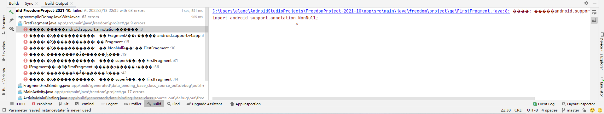

# Entry 3
##### 2/13/2022

### Progress
Thought the past few weeks, I have been watching several videos on YouTube that help to understand how Android Studio work and the tools that the application needed be for running it. The video I watch is [Android Development for Beginners - Full Course](https://www.youtube.com/watch?v=fis26HvvDII&t=2094s) and [#1 Login and Registration Android App Tutorial Using Firebase Authentication - Create User](https://www.youtube.com/watch?v=Z-RE1QuUWPg&t=195s). I try to start building our minimum viable product start with building the user authentication page. But I realize that before doing that I have to learn more about the Android Studio application first, because before I start coding, just loading that empty page causes several bugs. And so, I had to spend another week start learning the small part of android studio and trying to debug.
### Problem I encountered
#1 Before running and checking with code I learned, I first need an AVD (Android Virtual Device) system to run our project on a virtual android app. Before we thought that we will need to set up the AVD by ourselves and needed to download an app called BlueStacks, but then we realized that Android Studio has its own AVD that we need to set up within it.
    
#2 After setting up the AVD I tried to run the app without any code in it to make sure we set everything up correctly, but we first encounter bugs one after one. 

```'android.useAndroidX' property is not enabled```
 This is the first bug I encounter is when running the app to see the change I made, by searching up I know that this bug happen because my project uses AndroidX dependencies, but the 'android.useAndroidX' property is not enabled.
 >Solution - I added the following code into my Gradle.properties located in the SDK file. 

``` java
android.useAndroidX=true
android.enableJetifier=true
```



This is the current bug I have that I had no idea why it happen and how to solve, it appears as much of a question mark. Now we are discussing and trying to find out what causes this bug.

### What step are we on?

After **planning the most promising solution**, we had an outline of what our project might look like. Now we are heading our way to the 5th step of the engineering design process - **Create a prototype** of our app.

During the weekend I and my partner used google and group chat to work towards our goal, when we encounter a bug, we will first tell the other one who is learning the tools and start to google the solution of the bug. 

[Previous](entry02.md) | [Next](entry04.md)

[Home](../README.md)